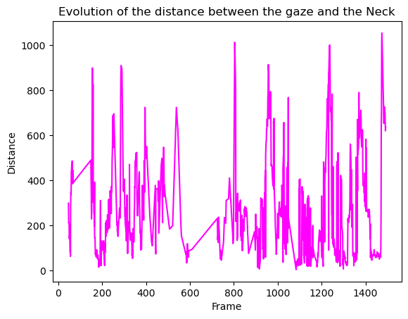

# How to analyze results obtained with the GazeClassify package ?
***
Running the GazeClassify package on eye tracking data should get you a csv file of this type.
| Frame     | Name | Distance | Instance_id | Instance |
| ----------- | ----------- | ----------- | ----------- | ----------- |
| 1   | Human_Shape | 0 | 0 |
| 1   | Human_Joints | 250 | 0 | Neck
| 1   | Human_Joints | 15 | 0 | Left Knee
| 1   | Human_Joints | 200 | 0 | Right Shoulder
| ... | ... | ... | ... | ...
| Final frame

For each frame, the Human\_Shape line indicates if the gaze is on a human shape (Distance = 0) or outside (Distance > 0) and which human shape is reffered (Person_id). Then, also for each frame, it proceeds to show the distance between the gaze and each joint (in this table there is only 3 for the example). The distance from each joint is here whether or not the gaze is located on or outside of the human shape.

With this data, you can then precisely determine the location of gaze with a process similar to triangulation. However, this process might be difficult to apply when you have a lot of footage and it might not be the results you are looking for.

To ease the analysis of gaze behavior, we created a class, **ResultAnalysis**, which should hopefully enable you to get interesting and visual results from your csv file.

## The ResultAnalysis class
***
###  \_\_init\_\_ function
The \_\_init\_\_ function of this class organizes the data obtained from the csv file and is a requirement in order to get the interesting results with the other functions. The input for this function is the path to your result.csv file obtained from the GazeClassify package. This path shoud be inputed as such:
```Python
ResultAnalysis("C://Users/Files/Result.csv")
```
***
### results function
The results() function of this class utilize the original data to return a new pandas' dataframe containing for every joint the pourcentage of frames where it was the closest to gaze irrelevantly of wether the gaze is located on or outside of the human shape. This dataframe will be shaped like this: 
| Joint    | n | Percentages |
| ----------- | ----------- | ----------- |
| Neck | 210| 22.12 |
| Left Knee | 130 | 13.70 |
| Right Shoulder | 66 | 6.95 |
| ... | ... | ...|
| Last joint | 18 | 1.89 |

"n" corresponds to the number of frames where each joint was the closest to gaze whereas "Percentages" corresponds to the proportion of those frames compared to the total of frames in the footage.

An example of successfully calling this function could be: 
```Python
Variable_name = ResultAnalysis("C://Users/Files/Result.csv").results()
```
The dataframe will then be assigned to the variable : "Variable\_name".
***
### table function
The table() function of this class returns the same data as the results() function but in the shape of a markdown table ready to be shared!

An example of successfully calling ths function could be:
```Python
Table_name = ResultAnalysis("C://Users/Files/Result.csv").table()
```
The table will then be assigned to the variable : "Table\_name".
***
### piechart function
The piechart() function of this class allows you to visualize the same data that is obtained with the results() function but in the shape of a pie chart.
An example of successfully calling ths function could be:
```Python
Piechart_name = ResultAnalysis("C://Users/Files/Result.csv").piechart()
```    
Example of piechart obtained with this function.

***
### barplot function
The barplot() function of this class allows you to visualize the same data that is obtained with the results() function but in the shape of a bar plot.
An example of successfully calling ths function could be:
```Python
Barplot_name = ResultAnalysis("C://Users/Files/Result.csv").barplot()
```    
Example of barplot obtained with this function.

***
### timeseries\_human\_shape function
The timeseries\_human\_shape() function of this class allows you to represent the evolution of the distance between the location of gaze and the human shape as a function of frames. The distance being aqual to 0 means that the gaze is located on the human shape.
An example of successfully calling ths function could be:
```Python
Human_shape_plot = ResultAnalysis("C://Users/Files/Result.csv").timeseries_human_shape()
```
Example of plot

***
### piechart\_human\_shape function
The piechart\_human\_shape() function of this class produces a pie chart corresponding to the pourcentages of frames where the gaze is located on or outside of human shape.
An example of successfully calling ths function could be:
```Python
Human_shape_piechart = ResultAnalysis("C://Users/Files/Result.csv").piechart_human_shape()
```
Example of plot

***
### timeseries\_plot function
The timeseries\_plot() function of this class allows you to represent the evolution of the distance between the location of gaze and a selected joint as a function of frames. The distance being equal to 0 means that the gaze is located directly on the selected joint.
The chosen joint should be the input (str) of the function. Possible inputs are these strings:
- "Left Ankle"
- "Right Ankle"
- "Left Elbow"
- "Right Elbow"
- "Neck"
- "Left Ear"
- "Right Ear"
- "Left Knee"
- "Right Knee"
- "Left Shoulder"
- "Right Shoulder"
- "Left Eye"
- "Right Eye"
- "Left Hip"
- "Right Hip"
- "Left Wrist"
- "Right Wrist". 

An example of successfully calling ths function could be:
```Python
Timeplot_name = ResultAnalysis("C://Users/Files/Result.csv").timeseries_plot("Neck")
```
Example of plot

***